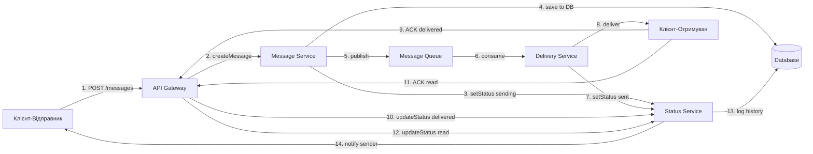
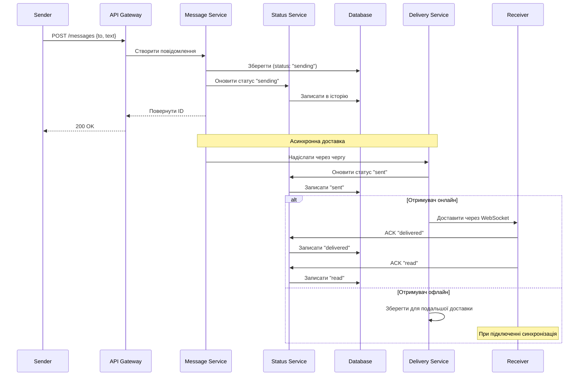

# Лабораторна робота 1
## Розробка систем обміну повідомленнями


Роботу виконав Сич Станіслав Олегович
Варіант 2
---
# Виконання

## Завдання 1: Створити схему компонентів

## Завдання 2: Діаграма послідовності



## Завдання 3: Діаграма стану

```mermaid
stateDiagram-v2
    [*] --> sending
    sending --> sent
    sent --> delivered
    delivered --> read
    read --> [*]
    
    sending --> failed
    sent --> failed
    delivered --> failed
    
    failed --> retrying
    retrying --> sent
    retrying --> [*]
    ```

## Завдання 4: ADR

##Status
Under consideration

##Desicion
Централізований Status Service з наступними обов'язками:

- Єдине джерело правди для всіх статусів повідомлень
- Валідація переходів між станами
- Зберігання повної історії змін статусів
- Публікація подій про зміни статусів

##Consequences
- Усі зміни статусів проходять через одну точку
- Унеможливлення конфліктуючих оновлень
- Легкий аудит та дебаггінг
- Якщо Status Service недоступний, система не може оновлювати статуси


---